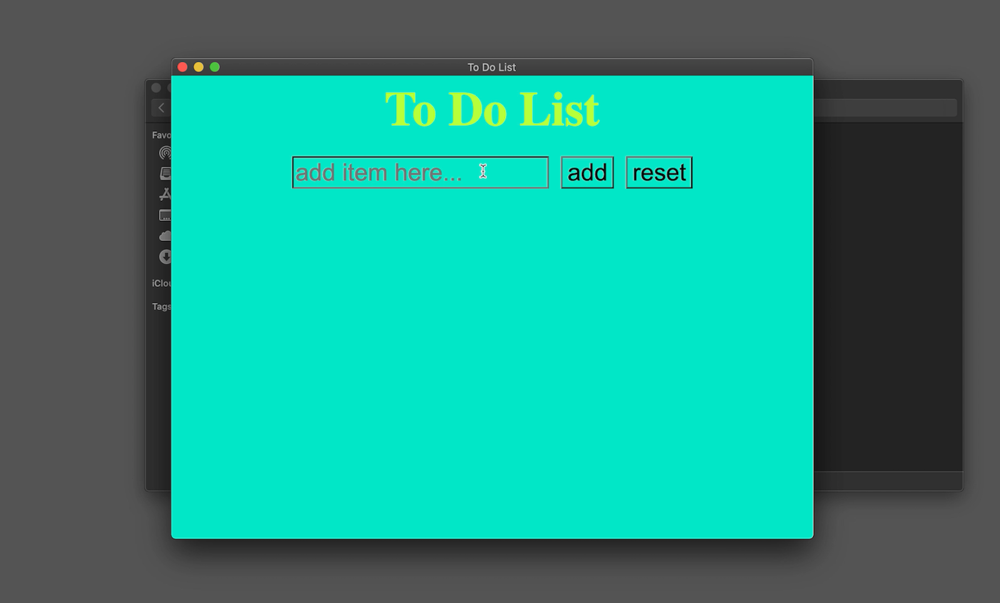
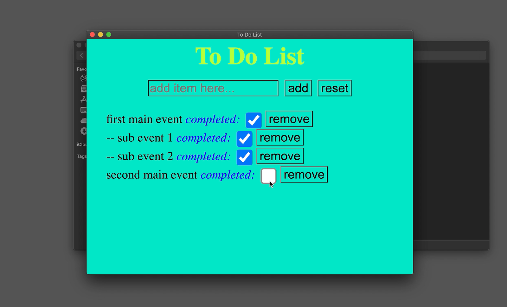

<h1>To Do List</h1>
This is To-Do-list desktop application built by Electron open source software.

<h2>Use Case; one will be added</h2>
Screen Shots:  

 
Video:  

<h2>How to Use</h2>
<h3>Required Environement:</h3>
Node.js and npm are needed to build/run the program
To check the availability
<pre><code>node -v</code></pre>
<pre><code>npm -v</code></pre>
node version: v16.15.1 is used in this project 
npm version: 8.11.0 is used in this project
  
<h3>Set Up:</h3>
Install the electron package
<pre><code>npm install --save-dev electron</code></pre>
Running the app from the terminal
<pre><code>npm start</code></pre>
 
<h3>Packaging and Distribution of App using Electron Forge:</h3>
Install Electron Forge and Update the package.json file
<pre><code>npm install --save-dev @electron-forge/cli</code></pre>
<pre><code>npx electron-forge import</code></pre>
Create packaged app (it will be located in out/to-do-list-darwin-x64/to-do-list)
<pre><code>npm run make</code></pre>
 
updated: July 15, 2022